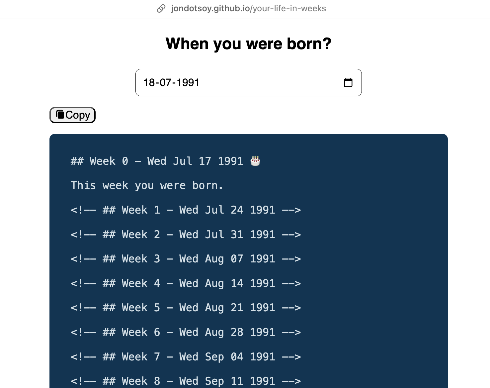

# Your Life in Weeks

**Based on the concept by Tim Urban**

This project is inspired by the article "Your Life in Weeks" published on Wait But Why, where Tim Urban illustrates the structure of a person's life from conception to old age.

## Live Demo

You can see a live version of this project at https://jondotsoy.github.io/your-life-in-weeks/. This demo showcases a plantilla for all the weeks in your life.



- [es](https://jondotsoy.github.io/your-life-in-weeks/?lang=es): https://jondotsoy.github.io/your-life-in-weeks/?lang=es

## Project Description

This project generates markdown files, one per week, outlining the structure of human life. The idea is to visualize how each stage of life fits together and help you appreciate the importance of every moment.

## Using the Generated Document

The generated document starts with a title section for each week, containing the number of the week and the corresponding date. Each section can include events, where each paragraph is considered an event. To use this document effectively:

### Long Events

*   To declare events that start on a certain date and end on a certain date, use the key words "Inicia", "Comienza", "Start".
*   If you find a similar event, you can close the event if you encounter another future event that starts with the word "Termina", "Finaliza", "Concluye", "Finish".

Example:

```md
## Week 1096 - Sat Jul 14 2012

Start my work at the amazing company

## Week 1409 - Sat Jul 14 2018

Finish my work at the amazing company
```

### Individual Events

*   By default, each paragraph is declared as an individual event.
*   You can highlight or categorize the event if you wish.

Example:

```md
## Week 1350 - Sat May 27 2017

Won the award for best fantasy writer 2017
```

## Contributing

Feel free to contribute to this project by sending a pull request or suggesting new features.
