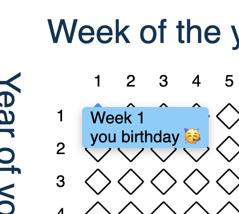

## Objective of this document

This document serves as a public declaration of the improvements that will be made to our project. It outlines the key milestones, goals, and timelines for the development and delivery of these enhancements.

## Roadmap

The following roadmap provides an overview of the planned features, their expected release dates, and the current status:

### 🚧 Active

<!--
| Feature | Expected Release Date |
| --- | --- |
| User Interface Updates | Q2 2023 |
| Improved Performance | Q3 2023 |
-->

| Feature | Expected Release Date |
| --- | --- |
| [Create Life Calendar Website](#create-life-calendar-website) | August 2024 |

### ⏳ Planned

<!--
| Feature | Status | Expected Completion Date |
| --- | --- | --- |
| Bug Fixing | In Progress | March 15, 2023 |
| New Features Development | In Progress | April 30, 2023 |
-->

| Feature | Status | Expected Completion Date |
| --- | --- | --- |
| [Create Life Calendar Editor](#create-life-calendar-editor) | On Design | September 2024 |
| [Create Life Calendar API Library](#create-life-calendar-api-library) | On Design | September 2024 |
| [Button copy button compatible with HTML format](#button-copy-button-compatible-with-html-format) | On Design | August 2024 |

## Proposals

The following proposal outlines a potential feature and its expected timeline:

<!--
### Proposal: [Insert Proposal Title]

[Description]
-->

### Create Life Calendar Website

Create a web page that displays the "Life Calendar" in a visually appealing and user-friendly manner, allowing users to print or download the calendar for their personal use. The page should include a brief introduction to the concept of the life calendar, along with a clear layout and design that makes it easy to navigate and find specific events and dates.

The Life Calendar website can be accessed at https://jondotsoy.github.io/your-life-in-weeks/life-calendar.

### Create Life Calendar Editor

Implement an interactive web-based editor that allows users to connect their GitHub or Google Drive accounts, retrieve their life calendar events, and edit them in a text-based format using Markdown syntax. The editor should provide a user-friendly interface for adding, editing, and deleting events, as well as synchronizing changes with the connected cloud storage service.

### Create Life Calendar API Library

Develop a JavaScript library that can be used in both browser and Node.js environments (including Bun and Deno) to parse and interpret life calendar events stored in Markdown format. The library should be designed as an API, allowing developers to easily integrate it into their applications.

The API should provide methods for:

*   Parsing Markdown-formatted life calendars
*   Serializing parsed life calendar data into a usable format (e.g., JSON)
*   Displaying life calendar events in a human-readable format (e.g., HTML)

This library will be used to power the Life Calendar website, allowing it to dynamically generate and display life calendar events from Markdown-formatted sources.

**Library Requirements:**

*   Browser compatibility (latest versions of Chrome, Firefox, Edge, etc.)
*   Node.js compatibility (14.x and later)
*   Compatibility with Bun and Deno

**API Endpoints:**

*   `parseLifeCalendar(markdownText)`: Returns a JSON object containing the parsed life calendar events
*   `serializeLifeCalendar(jsonData)`: Serializes the provided JSON data into Markdown format

### Button copy button compatible with HTML format

On page generator the roadmap generated have a button to copy the content on markdown format. using the api clipboard is required write on clipboard on markdown, plain and HTML formats.

